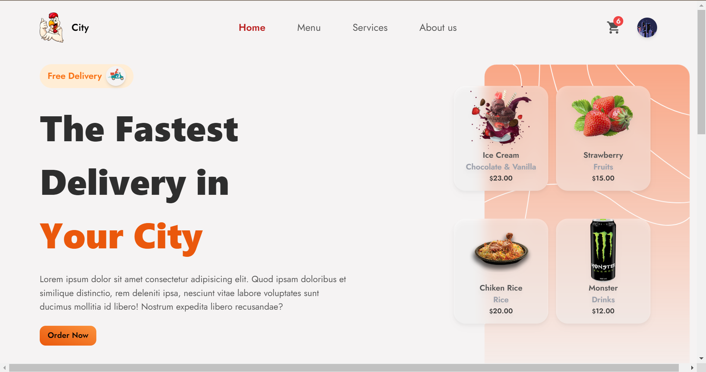
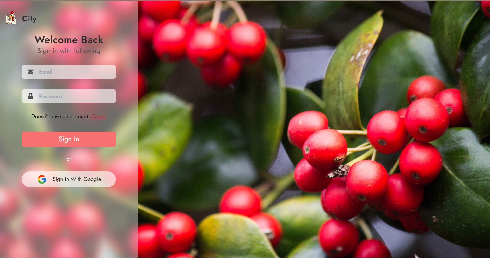
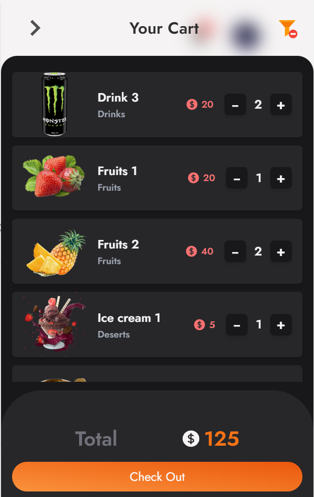
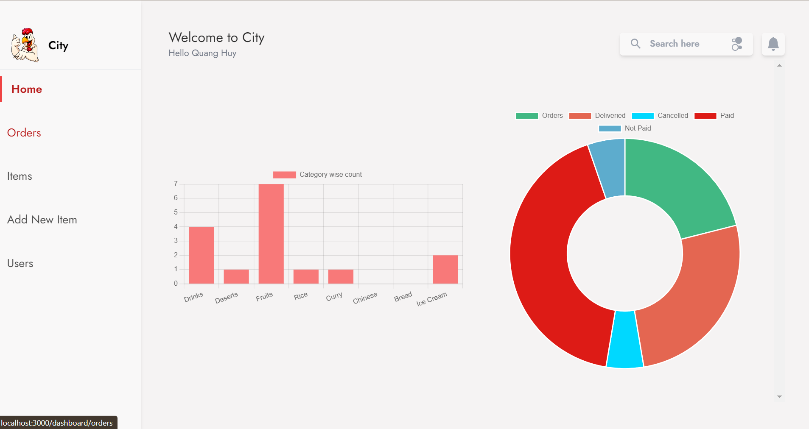
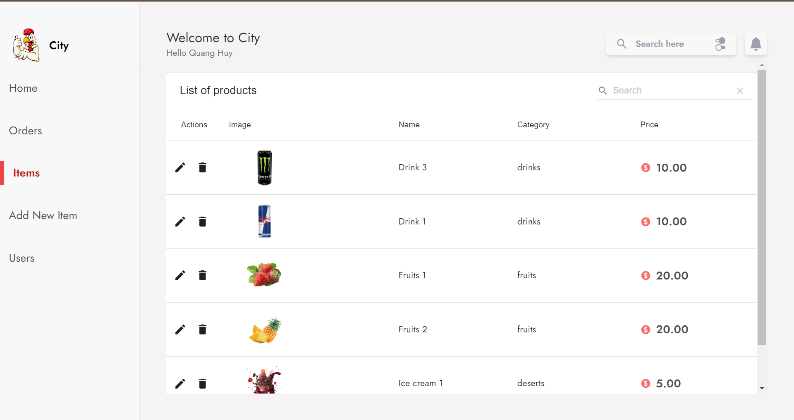
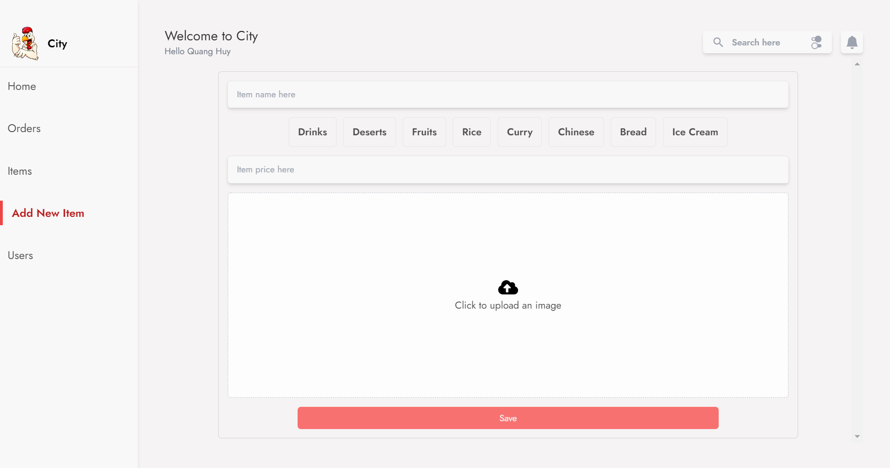
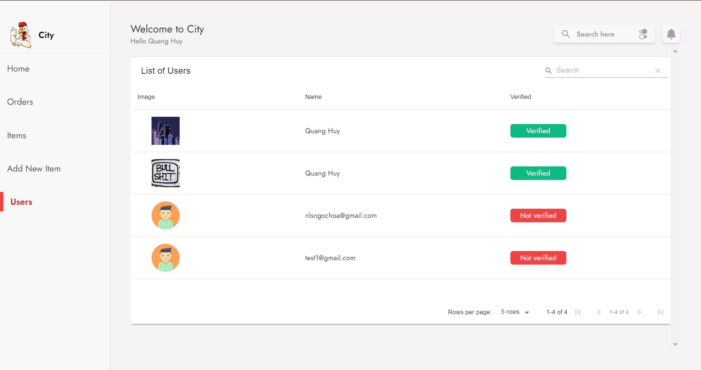
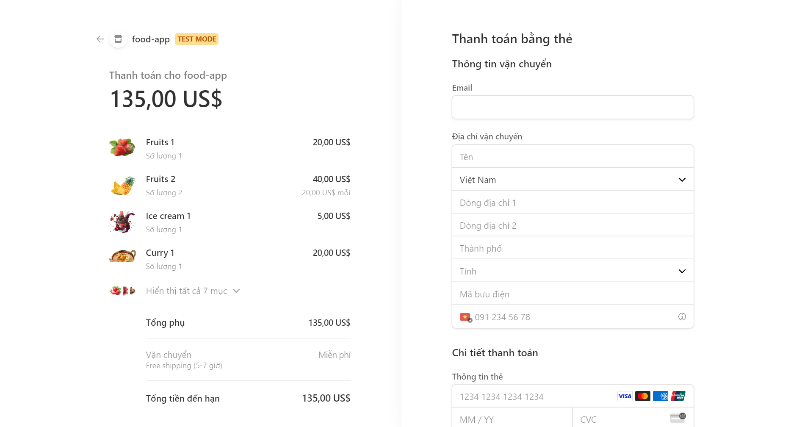

# Food app

## 1. Description

- A full stack food delivery application using Reactjs, Firebase as Backend. This projects focus on practicing react, redux, hooks and folder structure of a react app with detail instruction from vetrivel ravi (https://www.youtube.com/@VetrivelRavi) on youtube.

## 2. Installation and usage

-- How to run it?

- step 1: clone it to your local machine (git clone https://github.com/emsiqh/fullstack-foodapp)
- step 2: open terminal -> cd to the project directory (cd fullstack-foodapp)
- step 3: go to client folder (cd client) -> (yarn add/npm install) to install all dependencies -> (yarn start/npm start)
- step 4: go to server folder (cd server) -> cd to functions (cd funtions) -> (npm install) -> (npm run serve)

## 3. Tech stack

- ReactJS (18), HTML, CSS, JavaScript, Redux, React Router v6, Tailwind Css, Firebase Funtions.

## 3. Some main functions

### 1. Login

### 2. Cart

### 3. Dashboard

### 4. Items management

### 5. Add new item

### 6. User management

### 6. Checkout with Stripe

